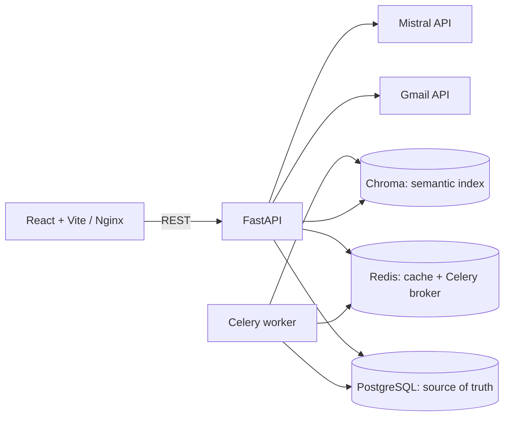
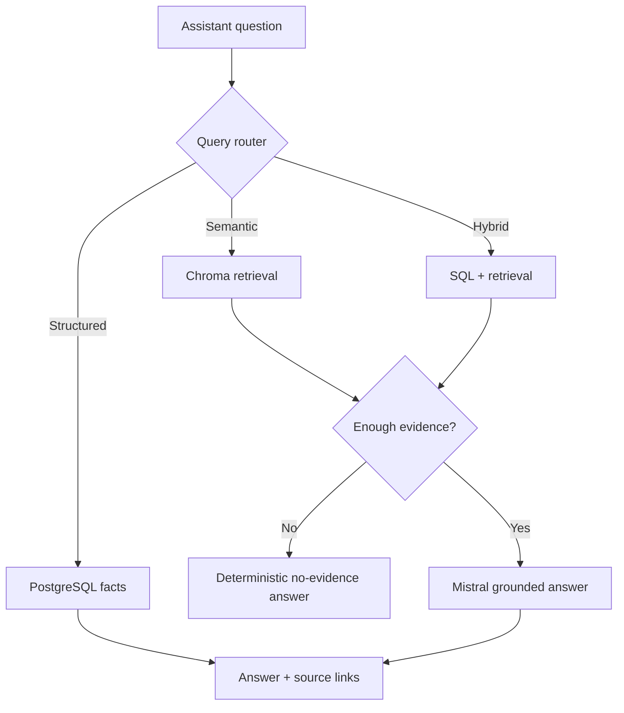

# AI Inbox Copilot

An end-to-end GenAI inbox workspace: Gmail email becomes summaries, tasks, meetings, semantic search results, grounded answers, and human-approved reply drafts. PostgreSQL stores product truth; Chroma is a rebuildable semantic index.

## Highlights

- Gmail connection with the minimum scopes: `gmail.readonly` and `gmail.send`.
- Mistral analysis extracts category, priority, summary, tasks, meetings, entities, and reply need.
- Dashboard shows real counts, recent important email, and upcoming deadlines.
- Assistant routes questions to deterministic SQL, semantic RAG, or hybrid answers with source links.
- Reply drafts are editable and are sent only after explicit approval.
- Celery + Redis run Gmail sync, reprocessing, and Chroma reindexing in the background.

## Architecture





## Technology

| Area | Choice |
| --- | --- |
| UI | React, Vite, Tailwind CSS |
| API | FastAPI, Pydantic Settings, SQLAlchemy, Alembic |
| AI | Mistral through LangChain LCEL |
| Storage | PostgreSQL and persistent Chroma |
| Async work | Celery + Redis |
| Delivery | Docker Compose, Nginx, GitHub Actions |

## Repository layout

```text
frontend/                  React app and Nginx production image
backend/
  app/                     API, services, database, GenAI, Gmail, workers
  alembic/                 PostgreSQL migrations
  scripts/                 Offline demo seeding and evaluation runner
  tests/                   Unit, reliability, and evaluation tests
docs/                      Architecture and limitations notes
docker-compose.yml         Local production-like stack
```

## Quick start: Docker Compose

1. Copy the safe template and set every value marked `CHANGE_ME`:

   ```powershell
   Copy-Item .env.example .env
   ```

2. Set a strong `POSTGRES_PASSWORD`, Compose-network `DATABASE_URL`, Mistral key, and Google OAuth values. The template's `postgres`, `redis`, and `backend` hostnames are intentional.

3. In Google Cloud Console, enable Gmail API and add this redirect URI exactly:

   ```text
   http://localhost:8000/api/gmail/callback
   ```

   Add your Gmail account as an OAuth test user. Never commit OAuth secrets or `token.json`.

4. Start the complete stack:

   ```powershell
   docker compose up --build
   ```

   Open [http://localhost:5173](http://localhost:5173). Health: [http://localhost:8000/health](http://localhost:8000/health); readiness: [http://localhost:8000/health/ready](http://localhost:8000/health/ready).

5. Stop while keeping database and index volumes:

   ```powershell
   docker compose down
   ```

   Use `docker compose down --volumes` only when intentionally erasing local Compose data.

## Local development

Prerequisites: Python 3.13+, Node 22+, PostgreSQL, and Redis.

```powershell
# terminal 1 — backend
cd backend
Copy-Item .env.example .env
.\.venv\Scripts\Activate.ps1
pip install -r requirements-dev.txt
alembic upgrade head
uvicorn app.main:app --reload --port 8000
```

```powershell
# terminal 2 — worker
cd backend
.\.venv\Scripts\Activate.ps1
# Windows uses solo because Celery's prefork process pool is not reliable there.
celery -A app.workers.celery_app:celery_app worker --loglevel=info --pool=solo
```

```powershell
# terminal 3 — frontend
cd frontend
npm ci
npm run dev
```

For a direct local run, Redis URLs should use `redis://localhost:6379` and the database host stays `localhost`. Compose hostnames work only inside Docker.
On Windows, keep the worker command's `--pool=solo`; the Docker worker runs on Linux and uses two concurrent processes.

## Configuration and security

`backend/app/config.py` centralizes configuration through Pydantic Settings. In `APP_ENV=production`, startup fails if database, Mistral, OAuth, token encryption, HTTPS frontend URL, or restrictive CORS requirements are missing. The API has request IDs, structured request logs, a request-size limit, typed errors, and health/readiness endpoints.

- `backend/.env.example` is for direct backend development.
- Root `.env.example` is for Docker Compose.
- `.env`, OAuth credentials, tokens, Chroma data, and logs are ignored by Git.
- Frontend requests use same-origin `/api` in Docker/Nginx and `http://localhost:8000` by default in Vite development.
- `TOKEN_ENCRYPTION_KEY` must be one stable Fernet key in every production environment. Generate it once with `python -c "from cryptography.fernet import Fernet; print(Fernet.generate_key().decode())"`, store it only in your secret manager, and do not rotate it without a credential migration.

## Gmail, reliability, and recovery

Sync returns a Celery job ID immediately; React polls status. PostgreSQL has a unique Gmail-message guard, Redis adds a sync lock, and failed records can be reprocessed. Chroma failure never deletes a persisted email; reindex later. Compose runs `alembic upgrade head` through the `migrate` service. For `not_ready`, inspect `docker compose logs backend worker migrate` and confirm Postgres/Redis health.

## Demo data

Seed clearly labelled synthetic mail without Gmail or Mistral calls:

```powershell
cd backend
.\.venv\Scripts\Activate.ps1
python scripts/seed_demo_data.py
```

The seed is idempotent. For semantic search, run the normal full-index action after configuring Mistral.

## Render backend + Vercel frontend

This repository includes `render.yaml` for a small Render deployment. It creates a Render web service, managed Postgres, and Redis-compatible Key Value. API and Celery run together in the web container so they share the one persistent `/app/data` disk used by embedded Chroma and the legacy local OAuth token. Render disks cannot be shared between separate services, which is why the worker is intentionally co-located for this deployment shape.

1. Deploy the Vite frontend on Vercel first: import this GitHub repo, set **Root Directory** to `frontend`, and deploy. Copy its HTTPS URL.
2. In Render, select **New > Blueprint**, connect the same repository, and choose `render.yaml`. Use a paid plan: the persistent disk and background processing need it.
3. In Render's secret prompt, set `MISTRAL_API_KEY`, Google OAuth values, one persistent `TOKEN_ENCRYPTION_KEY`, and:

   ```text
   FRONTEND_ORIGINS=https://your-vercel-app.vercel.app
   FRONTEND_URL=https://your-vercel-app.vercel.app
   ```

4. After Render provides the API URL, update `GOOGLE_REDIRECT_URI` to:

   ```text
   https://your-render-service.onrender.com/api/gmail/callback
   ```

   Add the same URL in Google Cloud Console under Authorized redirect URIs.
5. In Vercel, add production environment variable `VITE_API_BASE_URL` with the Render API URL (without a trailing slash), then redeploy the frontend.

Phase 9 adds the database foundation for isolated accounts and encrypted per-user OAuth credentials, but the current browser flow still uses the legacy local connection. Do not advertise the current deployment as a public multi-user product until Phase 10 enables authenticated Google sign-in and per-user sync.

## Phase 9 — multi-user data foundation

The migration `0005_multi_user_foundation` introduces `users` and encrypted `gmail_connections`, scopes persisted emails/tasks/meetings/drafts to an owner, makes the Gmail message uniqueness rule per user, and adds a user filter to Chroma retrieval metadata. Existing local inbox records are preserved under a `legacy-local-user` account.

For an existing installation:

```powershell
cd backend
.\.venv\Scripts\Activate.ps1
alembic upgrade head
```

Then run one full reindex before relying on semantic search, so legacy chunks are rebuilt with owner metadata. The next phase adds the login/session layer and passes the authenticated user ID into this foundation; the current app intentionally remains backward-compatible with the existing local Gmail connection.

## Tests and offline GenAI evaluations

```powershell
cd backend
.\.venv\Scripts\Activate.ps1
pytest -q
python scripts/run_evals.py

cd ..\frontend
npm ci
npm run build
```

Offline fixtures use synthetic `@example.test` mail and mock model/retrieval behavior. They cover router choices, RAG no-evidence behavior, citations, and reply-safety guardrails without Gmail, Mistral, or network access.

## API highlights

| Endpoint | Purpose |
| --- | --- |
| `GET /health`, `GET /health/ready` | Liveness and Postgres/Redis readiness |
| `POST /api/gmail/sync`, `GET /api/jobs/{job_id}` | Queue Gmail sync and monitor it |
| `GET /api/emails`, `GET /api/emails/{id}` | Persisted inbox and email detail |
| `GET /api/dashboard` | Counts, important email, and deadlines |
| `POST /api/search/semantic` | Source-linked semantic search |
| `POST /api/chat/inbox` | Structured/RAG/hybrid assistant |
| `POST /api/emails/{id}/draft-reply` | Create editable reply draft |
| `PATCH /api/drafts/{id}`, `POST /api/drafts/{id}/approve`, `POST /api/drafts/{id}/send` | Human approval flow |

## Demo flow

1. Start the stack and connect Gmail.
2. Sync a small batch and watch its job status.
3. Show extracted tasks/meetings and the cleaned original email body.
4. Ask “What should I prioritize today?” and open a source.
5. Generate, edit, approve, and explicitly send a reply draft.
6. Open Dashboard to show live high-priority mail and deadlines.

## Further reading

- [Interview guide](docs/INTERVIEW_GUIDE.md)
- [Current limitations](docs/LIMITATIONS.md)

Phase 9 is complete: the project has multi-user data ownership and encrypted connection storage. Phase 10 will add browser authentication, per-user Gmail OAuth callbacks, and user-scoped API/session enforcement before public multi-user launch.
