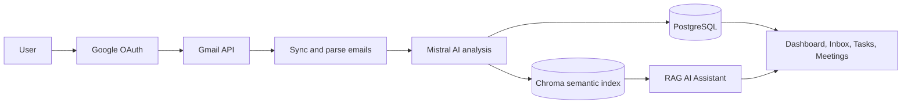

# AI Inbox Copilot

> Turn Gmail into clear, actionable next steps.

[**Open the live app**](https://inbox-copilot-woad.vercel.app) · [Portfolio](https://portfolio-blond-phi-6yszdranfc.vercel.app/) · [LinkedIn](https://www.linkedin.com/in/satyam-srivastav07/)

AI Inbox Copilot is a full-stack GenAI workspace that connects to a user's Gmail account, analyses recent mail, extracts priorities, tasks, meetings, and answers questions from the user's own inbox. Gmail access is user-authorized and every reply needs explicit approval before it can be sent.

## What it does

- Secure Google sign-in and per-user Gmail connection.
- Automatically syncs the latest 20 inbox messages after Gmail is connected.
- Uses Mistral AI to create summaries, categories, priorities, action items, meetings, entities, and reply-required signals.
- Stores each user's emails and extracted data in PostgreSQL.
- Provides an Inbox, Dashboard, Tasks, Meetings, Gmail Inbox, and AI Assistant experience.
- Uses RAG to answer inbox questions from relevant synced emails rather than generic model knowledge.
- Creates editable reply drafts; an email is sent only after the user approves it.
- Includes responsive light/dark themes, data-deletion controls, and privacy/terms pages.

## Product flow



## RAG in this project

When a user asks a question such as *“What deadlines are mentioned in my recent emails?”*, the application:

1. Searches the user's own indexed inbox for relevant email content.
2. Sends only that relevant context to Mistral.
3. Returns a grounded answer based on the retrieved emails.

This keeps answers relevant to the user's inbox and reduces hallucinated responses.

## Tech stack

| Area | Technology |
| --- | --- |
| Frontend | React, Vite, Tailwind CSS |
| Backend | Python, FastAPI, Pydantic, SQLAlchemy, Alembic |
| AI | Mistral AI, LangChain |
| Email | Gmail API, Google OAuth 2.0 |
| Database | PostgreSQL |
| Semantic search | Chroma vector store |
| Caching / jobs | Redis-compatible Key Value, Celery for local worker mode |
| Deployment | Vercel frontend + Render API, PostgreSQL, and Key Value |
| CI | GitHub Actions |

## Architecture

```text
Vercel React app
      |
      | same-origin /api rewrite
      v
Render FastAPI API
      |---------------------> Google OAuth + Gmail API
      |---------------------> Mistral AI
      |---------------------> PostgreSQL (users, emails, tasks, meetings, drafts)
      |---------------------> Chroma (semantic email index)
      └---------------------> Redis / Key Value (cache and local job support)
```

## Privacy and safety

- Users can only sync the Gmail account that they authorize.
- OAuth credentials are encrypted before storage using a Fernet key.
- Each saved email belongs to a specific user account.
- The app requests Gmail read access for sync and Gmail send access only for an explicitly approved reply.
- Users can disconnect Gmail or permanently delete their stored account data from the app.
- Secrets, `.env` files, tokens, and local database data are excluded from Git.

## Running locally

### Prerequisites

- Python 3.13+
- Node.js 22+
- PostgreSQL
- Redis (required only for Celery background-worker mode)
- Google Cloud project with Gmail API enabled
- Mistral API key

### 1. Backend

```powershell
cd backend
Copy-Item .env.example .env
.\.venv\Scripts\Activate.ps1
pip install -r requirements-dev.txt
alembic upgrade head
python -m uvicorn app.main:app --reload --port 8000
```

### 2. Worker — local background mode only

```powershell
cd backend
.\.venv\Scripts\Activate.ps1
celery -A app.workers.celery_app:celery_app worker --loglevel=info --pool=solo
```

### 3. Frontend

```powershell
cd frontend
npm install
npm run dev
```

Open `http://localhost:5173`.

## Environment configuration

Create `backend/.env` from `backend/.env.example`. Never commit its values.

Important production settings:

```text
APP_ENV=production
DATABASE_URL=postgresql+psycopg2://...
MISTRAL_API_KEY=...
TOKEN_ENCRYPTION_KEY=<stable Fernet key>
SESSION_SECRET=<long random secret>
GOOGLE_CLIENT_ID=...
GOOGLE_CLIENT_SECRET=...
GOOGLE_REDIRECT_URI=https://your-vercel-domain/api/gmail/callback
FRONTEND_ORIGINS=https://your-vercel-domain
FRONTEND_URL=https://your-vercel-domain
SYNC_EXECUTION_MODE=request
```

Generate a Fernet key once and keep it stable:

```powershell
python -c "from cryptography.fernet import Fernet; print(Fernet.generate_key().decode())"
```

## Deployment

The deployed architecture uses a Vercel frontend and Render backend resources.

1. Import this repository into Vercel with `frontend` as the Root Directory.
2. Deploy the repository as a Render Blueprint using `render.yaml`.
3. Set production secrets in Render; do not put them in GitHub or frontend environment variables.
4. In Google Cloud Console, register this exact Vercel callback URL under **Authorized redirect URIs**:

   ```text
   https://your-vercel-domain/api/gmail/callback
   ```

5. Set the same URL as `GOOGLE_REDIRECT_URI` in Render and redeploy the API.

`frontend/vercel.json` proxies same-origin `/api/*` requests to Render. This preserves first-party browser sessions without exposing backend secrets to the frontend.

### Invite-only Google OAuth

This app is configured for invited testing users:

1. Google Auth Platform → **Audience**.
2. Keep the app as **External** and **Testing**.
3. Add intended Gmail accounts under **Test users**.
4. Do **not** publish the app when access should remain invite-only.

Public access requires Google's verification process for the requested Gmail scopes.

## Testing

```powershell
# Backend tests
cd backend
.\.venv\Scripts\Activate.ps1
python -m pytest -q

# Frontend production build
cd ..\frontend
npm run build
```

## Known free-tier behaviour

- Render can take time to wake after idle periods.
- The free deployment performs sync work in the user's request, so the first batch of 20 new messages may take a few minutes.
- Already analysed messages are reused from PostgreSQL and return much faster on later visits.
- For a high-volume production app, use a durable always-on worker and hosted vector database.

## Repository layout

```text
frontend/                  React/Vite frontend and Vercel rewrite configuration
backend/app/               FastAPI routes, Gmail, AI, database, RAG, and services
backend/alembic/           Database migrations
backend/tests/             Backend and reliability tests
docs/                      Deployment, interview, and limitations notes
render.yaml                Render Blueprint
```

## Author

Built by [Satyam Srivastav](https://www.linkedin.com/in/satyam-srivastav07/).

For questions or collaboration: [satyamsricode07@gmail.com](mailto:satyamsricode07@gmail.com)
